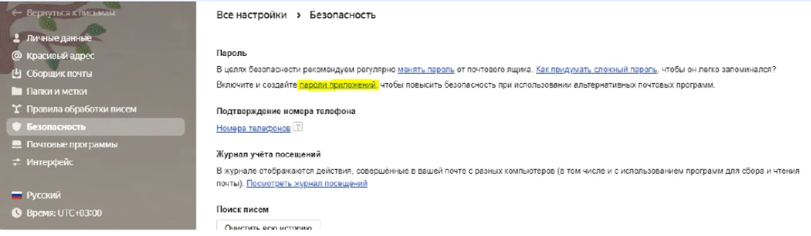
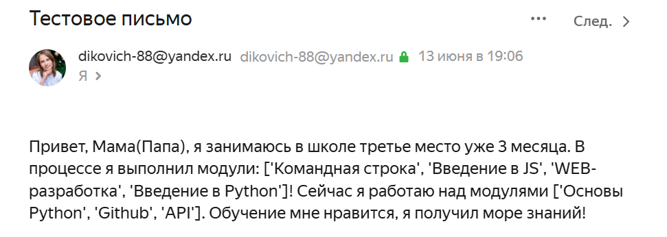

# Отправка писем по Яндекс.почте

## Оглавление

* [Описание проекта](#описание-проекта)
    * [Основные возможности](#основные-возможности)
    * [Предварительные требования](#предварительные-требования)
    * [Установите зависимости](#установите-зависимости)
    * [Обязательные файлы](#обязательные-файлы)
* [Запуск и использование](#Запуск-и-использование)
    * [Запуск программы](#запуск-программы)
* [Пример вывода](#Пример-вывода)
* [Цель проекта](#цель-проекта)

## Описание проекта

Данный скрипт позволяет отправлять письма кому угодно по Яндекс.почте с помощью библиотек `email` и `smtplib`


### Основные возможности

1. С помощью библиотеки `smtplib` отправляет письмо по почте.
2. Можно изменять текст письма.
3. Создает текст письма с помощью библиотеки `email`

### Предварительные требования:

1. Установленный [Python](https://www.python.org/downloads/) версии 3.11 и выше.
2. pip - установщик пакетов Python.
3. Доступ к интеренету(для отправки письма).

### Установите зависимости

С активированным виртуальным окружением установите зависимости проекта:

```bash
pip install -r requirements.txt
```

### Обязательные файлы

Для работы проекта вам потребуется создать в корке проекта файл с названием `.env`.

В этот файл вам потребуетсяя создать переменную в формате `PASSWORD=ваш-пароль`

#### Как получить пароль

Для работы программы в почте от которой вы будет будете отправлить письма потребуется сделать следующие действия:

После выполнения выше указанных действий все равно может выскочить ошибка `Error:authentication failed: This user does not have access rights to this service`. Ошибка возникает из-за специфики подключения к серверам smtp Яндекс. 

Для решения проблемы необходимо выполнить дополнительные настройки почты Яндекс:

- Необходимо открыть “Все настройки” → “Почтовые программы”:


- Далее необходимо создать “Пароль приложения”:



- И далее сохраните пароль, что вам даст приложение. 

`Если у вы после создания пароля не сохранили пароль, что вам предоставило приложение, придётся пересоздать пароль, так как пароль, что вам нужен появляется один раз.`

- И после получения пароля вставьте его в ваш файл .env, как значение переменной `PASSWORD`.

## Запуск и использование

### Запуск программы

```
python main.py
```

По итогу у вас отправиться письмо на почту, а в консоли ничего не будет выведено.


## Пример вывода



## Цель проекта

Код написан в образовательных целях на онлайн-курсе для веб-разработчиков [dvmn.org](https://dvmn.org/).
